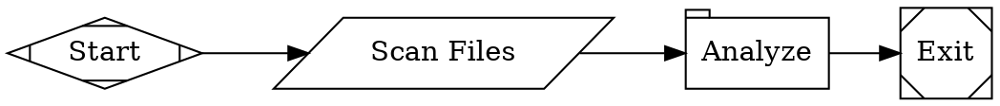

A workflow is a directed graph that defines a repeatable process for AI agents, shell commands, and human decisions. Unlike a DAG (directed acyclic graph), a Fabro workflow can and often does include loops — for example, implement-test-fix cycles that repeat until tests pass. You write workflows in [Graphviz DOT](/reference/dot-language), check them into version control, and run them with `fabro run`.

## Anatomy of a workflow

Every workflow is a `digraph` with a `goal`, a `start` node, an `exit` node, and one or more processing nodes connected by edges:

<Frame>
  
</Frame>



The `goal` attribute describes what the workflow accomplishes. Fabro uses it to guide agent behavior.

## Key node types

Each node's Graphviz **shape** determines how it executes. The three most important types are:

**Agents** (default `box` shape) run an LLM with access to tools — bash, file editing, sub-agents — looping autonomously until the task is complete:

```dot
implement [label="Implement", prompt="Read plan.md and implement every step."]
```

**Commands** (`parallelogram`) run shell scripts and capture output for downstream nodes:

```dot
validate [label="Run Tests", shape=parallelogram, script="cargo test 2>&1 || true"]
```

**Human gates** (`hexagon`) pause the workflow and wait for a person to choose a path. Edge labels define the options:

```dot
approve [shape=hexagon, label="Approve Plan"]

approve -> implement [label="[A] Approve"]
approve -> plan      [label="[R] Revise"]
```

Fabro supports additional node types for one-shot prompts, conditional branching, parallel fan-out/fan-in, and more. See [Stages and Nodes](/workflows/stages-and-nodes) for the full reference.

## Branching and loops

<Frame>
  
</Frame>

Edges can have **conditions** that route execution based on outcomes:

```dot
gate [shape=diamond, label="Tests passing?"]

gate -> exit      [label="Pass", condition="outcome=succeeded"]
gate -> implement [label="Fix"]
```

Loops are natural — just point an edge back to an earlier node. Use `max_visits` on a node to prevent infinite loops:

```dot
fix [label="Fix Failures", prompt="Fix the failing tests.", max_visits=3]
```

## Parallel execution

<Frame>
  
</Frame>

Fan out to run branches concurrently, then merge the results:

```dot
fork [label="Fan Out", shape=component]
merge [label="Merge", shape=tripleoctagon]

fork -> security
fork -> architecture
fork -> quality
security    -> merge
architecture -> merge
quality     -> merge
merge -> report -> exit
```

## Goal gates

Mark critical nodes with `goal_gate=true`. The workflow fails if any goal gate doesn't succeed — even if execution reaches the exit node:

```dot
validate [label="Validate", prompt="Run the test suite and verify all tests pass.", goal_gate=true]
```

## Running a workflow

From the CLI:

```bash
fabro run workflow.fabro
```

Or from a [run config TOML](/execution/run-configuration) for repeatable, parameterized runs:

```bash
fabro run run.toml
```

In the web UI, the Workflows page lists all available workflows. Click into a workflow to view its Graphviz definition, rendered graph diagram, and run history.

<Frame caption="The Workflows page lists all available workflows with their trigger type and last run time.">
  
</Frame>

<Frame caption="The workflow detail view shows the Graphviz definition with syntax highlighting.">
  
</Frame>

<Frame caption="The Diagram tab renders the workflow graph visually, showing nodes, edges, and conditions.">
  
</Frame>

<Frame caption="The Runs tab shows all runs for this workflow, filterable by status.">
  
</Frame>

See the [Quick Start](/getting-started/quick-start) to try it out, or browse the [example workflows](/examples/repl-handoff) for real-world patterns.

## Select workflow source and run target

`fabro run` and `fabro create` accept the same source and target options. `create`
registers the workflow and leaves a submitted run for you to start with
`fabro start RUN`. `run` also starts it, then attaches unless you pass `--detach`.

The required positional argument selects the workflow. With no source flags,
names are found in the current checkout, then a marked project, then installed
user workflows. Explicit local paths retain their usual package roots.

```sh
fabro run review
fabro create ./review.toml --target-path ../app
fabro run review --workflow-git acme/workflows --workflow-ref v1.2 \
  --target-git acme/app --target-branch release
```

In the last example, workflow instructions come from `acme/workflows`, and the
run works on `acme/app`. Neither selection changes the other. Local workflow paths,
`--goal-file`, and other caller inputs still resolve from the invocation context.
Without target flags, Fabro keeps its existing cwd/environment-based target
inference.

`--workflow-git OWNER/REPO` acquires source using native Git on your machine. A
workflow name selects `.fabro/workflows/NAME/workflow.toml` in that repository;
you can also supply an explicit repository-relative `.toml` or `.fabro` file.
Absolute paths, traversal, and directory selectors are rejected. A missing remote
workflow never falls back to a local or installed workflow.

`--workflow-ref` requires `--workflow-git`. Omit it, or use `HEAD`, to select the
remote default branch. You can select a branch, tag, or full 40-hex commit SHA.
If a branch and tag share a name, qualify it with `refs/heads/` or `refs/tags/`.
Fabro resolves the revision once, fetches that exact commit into a temporary
checkout, and registers its workflow-version closure. A moved or unavailable
commit never causes a fallback to a newer revision. Checkout hooks, content
filters, and implicit Git LFS expansion are disabled; submodules are not fetched.
Temporary files are removed after collection or failure. Interrupting acquisition
stops owned Git processes before cleanup; collection already in progress must
finish before its files can be removed.

Target selection depends on the environment:

| Selection | Local environment | Clone-based environment (Docker, Daytona, or plugin) |
| --- | --- | --- |
| Default cwd or `--target-path PATH` | Uses the live directory, including uncommitted files | Uses the enclosing Git repository and exact available commit; a non-Git directory selects an empty workspace |
| `--target-git OWNER/REPO` | Rejected | Uses the selected repository and exact observed branch commit; cloning must be enabled |

For clone-based execution, a target path selects a repository, not a subdirectory
working-directory override. Local target files are not uploaded. Existing target
observation may push committed local changes to origin; dirty changes are
excluded from clone targets and produce a warning. Detached or unavailable exact
commits fail. Folder targets require the directory to be accessible to the
server and its Local execution environment; passing a caller-local path does not
transfer it to a remote server.

`--target-branch` requires `--target-git` and accepts a working branch name, not a
tag or SHA. Without it, Fabro resolves the repository's default branch. The CLI
only looks up target metadata; the execution sandbox clones the target.
`--target-path` and `--target-git` conflict.

Local Git credential helpers, SSH-agent access through configured URL rewrites,
and user network configuration govern source acquisition and remote target
lookup. Fabro server login does not grant local Git access. The execution
sandbox still needs its own target-clone credentials.

`--dry-run` simulates execution; it can still fetch and upload workflow source,
and existing local target observation can still publish committed changes.
