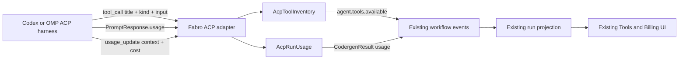

# ACP Tool Inventory and Billing Design

## Status

Approved in chat on 2026-08-19.

## Problem

Fabro's native API-backed agent publishes its complete tool registry and provider billing into the durable run projection. ACP-backed stages do not:

- codex and OMP emit individual ACP `tool_call` updates, but ACP does not provide a tool-inventory/list operation;
- Fabro currently uses each call's display title as a distinct dropdown entry, so argument-specific calls such as `Read file X` and `Read file Y` appear as different tools;
- the official OMP catalog is known, but Fabro does not seed it;
- codex-acp and OMP both return exact per-turn token usage in ACP `PromptResponse.usage`, but the Rust ACP helper reduces the response to `StopReason` and discards usage;
- ACP `usage_update.used` is current context occupancy, not per-turn token consumption, so treating it as billing would be incorrect.

The result is an incomplete Tools dropdown and zero/absent billing for codex and OMP stages.

## Goals

1. Group observed ACP calls by stable tool identity rather than display title.
2. Show OMP's official built-in catalog before tools are invoked.
3. Mark observed tools as invoked and append unknown/plugin tools.
4. Keep codex observed-only because its available tools vary by preset and configuration.
5. Preserve exact ACP per-turn token usage for codex and OMP.
6. Show reported USD cost only when a harness reports it; never present missing cost as `$0`.
7. Reuse the existing `agent.tools.available`, stage usage projection, and Billing UI.

## Non-goals

- Inventing a complete codex tool catalog.
- Claiming that OMP's documented catalog is its exact live surface when `--tools`, plugins, or configuration can change it.
- Estimating token consumption from context-window occupancy.
- Estimating USD cost from text length or context usage.
- Adding a second ACP-specific tools or billing UI.
- Changing ACP itself or requiring modified codex/OMP binaries.

## Evidence and constraints

### OMP tools

The official OMP tools index documents 23 built-ins and states that `/tools` displays the live tool surface while `--tools` can restrict it:

<https://omp.sh/docs/tools>

Documented names:

- `ast_edit`
- `ast_grep`
- `bash`
- `browser`
- `debug`
- `edit`
- `eval`
- `find`
- `generate_image`
- `github`
- `inspect_image`
- `irc`
- `job`
- `lsp`
- `read`
- `recipe`
- `report_tool_issue`
- `resolve`
- `search`
- `task`
- `todo`
- `web_search`
- `write`

OMP's ACP mapper sends a `ToolCall` with a display `title`, structured `kind`, and raw input. It does not send the original internal tool name. The display title may be intent text or include arguments.

### Codex tools

Codex tool availability varies by model preset, feature flags, and configuration. There is no trustworthy static catalog at the Fabro seam. Fabro must report only tools actually observed in ACP calls.

### ACP usage

The unstable ACP usage schema exposes:

- `PromptResponse.usage`: per-turn input, output, cached read/write, thought/reasoning, and total tokens;
- `SessionUpdate::UsageUpdate`: current context tokens, context-window size, and optional cumulative session cost.

OMP's ACP implementation builds exact per-turn usage from session statistics. The installed codex-acp implementation maps Codex token counts into the same prompt-usage structure. Both harnesses therefore provide exact token counts at prompt completion.

Fabro currently uses `ActiveSession::send_prompt`, whose Rust SDK callback destructures `PromptResponse { stop_reason, .. }`; the discarded fields cannot be recovered later.

## Design overview



Two deep modules contain the new behavior:

1. `AcpToolInventory`: catalog seeding, canonical identity, categorization, deduplication, and invoked-state transitions.
2. ACP prompt completion handling: preserve full prompt responses and aggregate exact usage behind the existing `run_acp_turn` interface.

Callers continue consuming `AgentToolsAvailable` and `CodergenResult`; UI modules need no ACP-specific interface.

## Tool inventory

### Interface

Conceptually:

```rust
struct AcpToolInventory { /* private */ }

impl AcpToolInventory {
    fn for_harness(harness: Option<&str>) -> Self;
    fn snapshot(&self) -> Vec<AgentToolSummary>;
    fn observe(&mut self, call: &AcpObservedTool) -> bool;
}
```

`observe` returns `true` only when the snapshot changes: a new canonical tool appears or an existing catalog entry changes from uninvoked to invoked. The ACP callback emits a full `agent.tools.available` snapshot only in that case. The run-state projection already replaces `stage.agent_tools` with the latest snapshot.

### OMP baseline

`for_harness(Some("omp"))` seeds the 23 official built-ins with:

- official name;
- official one-line description;
- Fabro tool category;
- source `Native`;
- `invoked=false`.

The catalog is explicitly documented as a shipped baseline, not the exact runtime registry. A source comment links to <https://omp.sh/docs/tools>.

### Codex baseline

`for_harness(Some("codex"))` starts empty. Codex entries appear only after observed calls.

### Canonicalization

ACP call data is transformed into a canonical identity separately from the call timeline. Timeline titles remain unchanged.

The canonicalizer uses structured ACP `kind` first, then title/input patterns where a more specific identity is safe.

Required examples:

| ACP display title | Canonical dropdown name |
|---|---|
| `Read file '/a.rs'` | `read_file` |
| `Read file '/b.rs'` | `read_file` |
| `List files` | `list_files` |
| `echo hello` | `shell` |
| `$ echo hello` | `bash` for OMP, `shell` otherwise |

OMP matching rules prefer an official catalog name. Structured kinds map conservatively:

- `read` → `read`
- `search` → `search`
- `execute` → `bash`
- `edit`, `delete`, `move` → `edit`
- `think` → `todo` only when the title/input identifies a todo/plan operation; otherwise an observed extension

When exact matching is not defensible, Fabro adds a normalized observed extension rather than falsely marking an official tool invoked.

Canonical names are stable, lowercase snake_case, and independent of arguments. Unknown/plugin tools are appended with an empty or generic description and `invoked=true`.

### Initial and live events

Before spawning an OMP ACP turn, the handler emits the seeded snapshot, producing `TOOLS 0/23` in the UI. Codex emits no empty snapshot.

During execution, each changed snapshot is emitted. Expected outcomes:

- OMP after four canonical calls: `TOOLS 4/23` (or more if plugin tools were observed);
- codex after read/list/shell calls: `TOOLS 3/3`.

## ACP usage and billing

### Preserving `PromptResponse`

Fabro will not fork the Rust ACP SDK. Instead, its ACP adapter will send `PromptRequest` directly through the active session's connection and route the complete `PromptResponse` through a private completion channel.

The existing active session remains responsible for session notifications and tool activity. The live read loop selects over:

- session notifications;
- prompt-completion responses;
- steering/interrupt notifications;
- cancellation deadlines.

Follow-up steering prompts use the same private send path. Every completed prompt contributes exactly once to aggregate usage.

### Usage model

Fabro ACP defines a harness-neutral result:

```rust
struct AcpRunUsage {
    input_tokens: u64,
    output_tokens: u64,
    cache_read_tokens: u64,
    cache_write_tokens: u64,
    reasoning_tokens: u64,
    total_tokens: u64,
    reported_cost: Option<AcpReportedCost>,
}

struct AcpReportedCost {
    amount: f64,
    currency: String,
}
```

Aggregation rules:

- sum each per-turn token bucket across completed prompts;
- calculate normalized `total_tokens` from the disjoint buckets;
- when a harness-reported total differs from the calculated disjoint total, retain the exact buckets, use their calculated sum for billing, and warn rather than fabricating an `other_tokens` bucket;
- saturate integer conversions and sums;
- use the latest cumulative session cost minus the pre-turn baseline when both are available;
- for a fresh session without a baseline, the latest cumulative cost is the stage cost.

### Workflow billing translation

`AcpRunResult` carries `Option<AcpRunUsage>`. The workflow ACP backend translates it into the existing `BilledModelUsage` returned by `CodergenResult::Text`.

Model identity is harness-scoped:

- provider `codex`, model from the node model attr or process profile label;
- provider `omp`, model from the node model attr/`PI_MODEL` or process profile label;
- generic ACP uses provider `acp`.

External exact usage uses a new fieldless `ModelBillingFacts::Reported` variant. Its invariants are:

- exact token buckets are retained;
- `Catalog::bill` returns no estimate for `Reported`;
- a valid reported USD amount populates `total_usd_micros`;
- absent cost remains `None`.

Cost validation:

- currency must be case-insensitive `USD`;
- amount must be finite and non-negative;
- multiplication to micros must be checked and rounded consistently;
- invalid or unsupported cost is ignored with a warning, not converted to zero.

The existing stage-completion event and Billing projection then render the ACP stage without frontend-specific branching.

### Context usage

`usage_update.used/size` is context-window telemetry, not billing. This implementation parses `usage_update` to retain its optional cumulative cost but does not project `used/size` into the Context section. A separate follow-up may add provider-authoritative context totals. The values must never be copied into input/output billing buckets.

## UI behavior

No new UI surface is required.

### Tools section

The existing heading remains `TOOLS invoked/total`.

- native Fabro agent: complete live registry, existing behavior;
- OMP: official baseline plus observed extensions;
- codex: canonical observed tools only.

The timeline preserves original call titles and arguments, so grouping does not erase diagnostic detail.

### Billing page

The existing per-stage table displays exact ACP input/output and cache breakdown. Model grouping uses the harness-scoped model identity. Cost displays only when reported.

Missing usage or cost uses the existing unavailable/empty treatment; no zero-value claim is introduced.

## Error handling

- Prompt response without usage: complete the stage with billing unavailable.
- Usage bucket overflow: saturate and warn.
- Total smaller than calculated disjoint buckets: use calculated total and warn.
- Negative, non-finite, non-USD cost: ignore and warn.
- Prompt completion channel closes unexpectedly: preserve the current ACP protocol error behavior.
- Duplicate prompt completion: ignore after the first completion for that prompt.
- Duplicate tool canonical identity: update invoked state, do not append.
- Unknown ACP tool kind/title: append a normalized observed extension with category `Other`.

## Compatibility

New fields remain optional and serde-defaulted where persisted. Existing runs continue projecting unchanged. Existing `agent.tools.available`, stage-completion billing, and Billing UI contracts remain the external interfaces.

No codex or OMP binary change is required. The design uses unstable ACP usage fields already enabled by Fabro's `agent-client-protocol` dependency.

## Testing

### Tool inventory

- OMP baseline contains exactly the 23 documented names.
- Baseline entries start `invoked=false`.
- `Read file X` and `Read file Y` collapse to one `read_file` entry.
- OMP calls mark the matching official entry invoked.
- Unknown/plugin calls append once.
- Snapshots emit only on state changes.
- Timeline tool titles remain unchanged.

### ACP usage

- Prompt completion preserves all token buckets.
- Multiple steering turns aggregate once each.
- Missing usage yields `None` rather than zero.
- Context occupancy is not counted as billing.
- Valid reported USD converts to micros.
- Invalid/non-USD reported cost remains unavailable.
- Cancellation and in-band error behavior remain unchanged.

### Projection and UI

- ACP `CodergenResult` supplies stage billing.
- Stage projection carries harness/model identity and exact buckets.
- Run Billing groups codex and OMP separately.
- OMP Tools heading renders `invoked/23`.
- Codex argument-specific reads render one canonical dropdown entry.

### Live verification

Run `ui-harness-compare` with codex, OMP, and native Fabro nodes. Browser verification checks:

- OMP seeded catalog and invoked statuses;
- codex grouped observed tools;
- unchanged native Fabro tools;
- separate codex and OMP Billing rows with exact token counts;
- absent cost is not displayed as `$0`.
